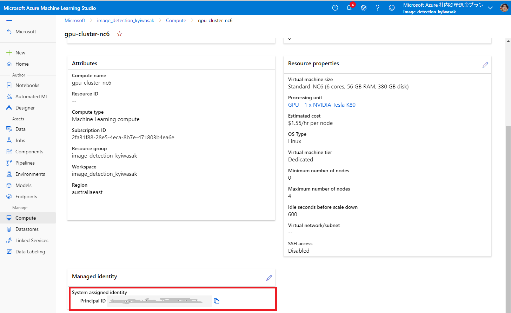

# a. Overview
This repository provides sample codes, which enable you to learn how to use auto-ml image classification (multi-label) under Azure ML(AML) environment.

# b. Prerequisites:
- Azure subscription, and its AML workspace
- Image files to be used

# c. How to use
## c.1 Azure environment, and AML Workspace
- Prepare [Azure subscription](https://azure.microsoft.com/en-us/free/), and [AML workspace](https://docs.microsoft.com/en-us/azure/machine-learning/concept-workspace). You may find [the steps here](00.%20provisioning.ipynb).

## c.2 Annotate for images and prepare datasets in AML
- With your owned image, execute data labelling with [the instruction](https://docs.microsoft.com/en-us/azure/machine-learning/how-to-create-image-labeling-projects)
    - [Export the labed dataset into Dataset in AML](https://docs.microsoft.com/en-us/azure/machine-learning/how-to-create-image-labeling-projects#export-the-labels). It will be used in training afterwards.
- Prepare `config.ini` under `/common` directory [with the instruction](./common/README.md)

## c.3 Populate pipelines in AML
- Once completing the prep in `c.2`, please populate pipelines for training deep learning model with Auto-ML image classification with basic model. You may find [the steps here](./10.%20AML_pipeline_train.ipynb)
    - We use AML pipeline as batch execution like deep learning training or inference with this repository. In order to do it, we need `train.py`, which will be embedded in the pipeline.

# d. TIPS of the Notebook
## d.1 Authentication
- As a preparation, we need to use AML workspace, and use two kinds of authentication
    - **`az` cli**[^1] in [00. provisioning](00.%20provisioning.ipynb)
        - You can find `az login` or `az login --use-device-code` with your preference.
    - **Managed identity** in [10. AML-pipeline_train](10.%20AML_pipeline_train.ipynb)
        - As usual authentication concept, we need two steps: `populate managed ID`, and `give access right to the populated ID`.
        - `Populate managed ID`:
            - In our sample impelementation, we set up as an argument `identity_type` in the method `AmlCompute.provisioning_configuration` in [10. AML_pipeline_train](./10.%20AML_pipeline_train.ipynb):

                ```python
                compute_config = AmlCompute.provisioning_configuration(
                    vm_size=vm_size,
                    idle_seconds_before_scaledown=600,
                    min_nodes=0,
                    max_nodes=4,
                    location=vm_location,
                    identity_type=managed_id, ## Require `SystemAssigned` for System assigned managed ID here
                 )
                ```
                By setting as above, we can use managed identity to retrieve AML workspace in executing actual batch pipelines in training of deep learning. Please see [this page](https://docs.microsoft.com/en-us/azure/machine-learning/how-to-create-attach-compute-cluster?tabs=python#set-up-managed-identity). You may make sure the populated managed ID in red-rectangle as follows:
        
                . 

        - `Give access rights to the populated ID`
            - After generating the identity, you need to assign the appropriate rights like `READ`, or `WRITE`(IAM) in Azure AD like `Enterprise Application` setting. [This site](https://stackoverflow.com/questions/66806261/is-it-possible-to-assign-a-system-managed-identity-to-an-azure-ad-enterprise-app) can help your understanding. 
        
        - `Retrieve AML workspace with the managed ID`
            - We can retrieve AML workspace as follows in [train.py](./train.py):
                ```python
                from azureml.core.authentication import MsiAuthentication
                ## Authentication with managed identity
                msi_auth = MsiAuthentication()

                ## Retrieve Azure ML workspace
                ws = Workspace(subscription_id=subscription_id,
                                resource_group=resource_group,
                                workspace_name=workspace_name,
                                auth=msi_auth)
                ```

## d.2 Selection of computer clusters
- GPU instance in [10. AML-pipeline_train](10.%20AML_pipeline_train.ipynb)
    - With GPU-instance in training with deep-learning model, we need specific VM series. In this repository, we pick up from `NC-6` series. Please make sure [the situation here](https://docs.microsoft.com/en-us/azure/machine-learning/how-to-auto-train-image-models?tabs=SDK-v2#compute-to-run-experiment). Indeed, we can choose `NC`-series in [specific region](https://azure.microsoft.com/en-us/global-infrastructure/services/?products=virtual-machines).
        ```python
        compute_config = AmlCompute.provisioning_configuration(
            vm_size=vm_size,
            idle_seconds_before_scaledown=600,
            min_nodes=0,
            max_nodes=4,
            location=vm_location,
            identity_type=managed_id,
        )
        ```

# e. Future tasks
- [ ] Inference process
    - [ ] Retrieve the latest model
    - [ ] Predict with given images
        - [ ] Convert the images into consumable format
    - [ ] Output as csv or other formats


# Reference
- [Training an Image Classification Multi-Class model using AutoML](https://github.com/Azure/azureml-examples/blob/main/python-sdk/tutorials/automl-with-azureml/image-classification-multiclass/auto-ml-image-classification-multiclass.ipynb)
- [Announcing Automated ML (AutoML) for Images](https://techcommunity.microsoft.com/t5/ai-machine-learning-blog/announcing-automated-ml-automl-for-images/ba-p/2843034)

[^1]: command line interface