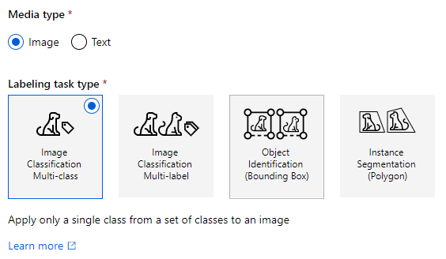

# a. Overview
This repository provides sample codes, which enable you to learn how to use auto-ml image classification, or object detection under Azure ML(AML) environment. 

__Target users__
- You want to **classify your photos** or **find objects from your photos** with your customized deep-learning models.
    - Please thihk about using [Custom Vision](https://www.customvision.ai/) for more simple development first.
- You don't want to customize the algorithms for image analysis so much.
    - This repository aims at the second-best strategy for simplicity[^1], and [auto machine learning technology provided by Microsoft](https://docs.microsoft.com/en-us/azure/machine-learning/how-to-auto-train-image-models?tabs=SDK-v2) is mainly used.
- You want to obtain the inferred results with the deep-learning models **at batch**.
    - Please find some contents in [references](#reference), if you're interested in real-time inference.

__Disclaimer__ 
- This repository aims at minimum system development with [some references](#reference). Major contents are quoted from them, and please check them if you're interested in more.
- This repository was actually confirmed with some sample images as of July in 2022. Please regard it as your guideline in developping your application.


# b. Prerequisites
- Azure subscription, and its AML workspace
- Image files to be classified
    - You can find [1 image file](./sample_images/60_1537642922.jpg) for testing inferring pipeline.

# c. How to use
This repository is divided into training and inferring pipeline, and you can find that both environments are the same with respect to the AML environment perspective, i.e. both pipelines use the same `compute_target`, `environment` etc in AML.

So, you can easily merge them by sorting out implementation of Input/Output, if you prefer. 


## c.1 Azure environment and AML Workspace
- Prepare [Azure subscription](https://azure.microsoft.com/en-us/free/), and [AML workspace](https://docs.microsoft.com/en-us/azure/machine-learning/concept-workspace). You may find [the steps here](00.%20provisioning.ipynb).

## c.2 Annotate for images and prepare datasets in AML
- Decide which image analysis will be satisfied with your demand between image classification or object detection.[^0]
     
    - `image classification` is divided as two tasks: `multi-class` and `multi-label`.
        - `multi-class`: We can select only one class for each image, and some class must be selected.
            ex.) Morning, Noon, Evening, Night
        - `multi-label`: We can extract plural labels for each image, and none of the labels can be selected in some cases.
            ex.) Picture with dogs, cats and whales, but it doesn't contain any animals there.
- Start data labelling with your image files under [the instruction](https://docs.microsoft.com/en-us/azure/machine-learning/how-to-create-image-labeling-projects)
    - [Export the labed dataset into Dataset in AML](https://docs.microsoft.com/en-us/azure/machine-learning/how-to-create-image-labeling-projects#export-the-labels). It will be used in training afterwards.
- Prepare `config.ini` under `/common` directory [with the instruction](./common/README.md)

## c.3 Populate pipelines in AML
- Once completing the prep in [c.2](#c2-annotate-for-images-and-prepare-datasets-in-aml), please populate pipelines for training deep learning model with Auto-ML image classification with [supported-model-algorithms](https://docs.microsoft.com/en-us/azure/machine-learning/how-to-auto-train-image-models?tabs=CLI-v2#supported-model-algorithms). You may find [the steps here](./10.%20AML_pipeline_train.ipynb)
    - You use AML pipeline as batch execution like deep learning training or inference with this repository. In order to do it, you need `train.py` or `inference.py`, which will be embedded in the pipelines.

# d. TIPS of the steps from technical point of view
## d.1 Authentication
- As a preparation, you need to use AML workspace, and use two kinds of authentication
    - **`az` cli**[^2] in [00. provisioning](00.%20provisioning.ipynb). Please check [the site](https://docs.microsoft.com/en-us/cli/azure/authenticate-azure-cli), if necessary.
        - You can find `az login` or `az login --use-device-code` with your preference.
    - **Managed identity** in [10. AML-pipeline_train](10.%20AML_pipeline_train.ipynb) and  [20. AML_pipeline_inference](./20.%20AML_pipeline_inferrence.ipynb)
        - As usual authentication concept, you need three steps: `populate managed ID`, `give access right to the populated ID`, and `retrieve AML workspace with the ID`
        - `Populate managed ID`:
            - In the sample impelementation, you set up as an argument `identity_type` in the method `AmlCompute.provisioning_configuration`:

                ```python
                compute_config = AmlCompute.provisioning_configuration(
                    vm_size=vm_size,
                    idle_seconds_before_scaledown=600,
                    min_nodes=0,
                    max_nodes=4,
                    location=vm_location,
                    identity_type=managed_id, ## Require `SystemAssigned` for System assigned managed ID here
                 )
                ```
                By setting as above, you can use `managed identity` to retrieve AML workspace in executing actual batch pipelines in training of deep learning. Please see [this page](https://docs.microsoft.com/en-us/azure/machine-learning/how-to-create-attach-compute-cluster?tabs=python#set-up-managed-identity). You may make sure the populated managed ID in red-rectangle as follows:
        
                . 

        - `Give access rights to the populated ID`
            - After generating the identity, you need to assign the appropriate rights like `READ` or `WRITE`(IAM) in Azure AD like `Enterprise Application` setting. [This site](https://stackoverflow.com/questions/66806261/is-it-possible-to-assign-a-system-managed-identity-to-an-azure-ad-enterprise-app) can help your understanding. 
        
        - `Retrieve AML workspace with the ID`
            - You can retrieve AML workspace as follows in [train.py](./train.py) and [inference.py](./inference.py):
                ```python
                from azureml.core.authentication import MsiAuthentication
                ## Authentication with managed identity
                msi_auth = MsiAuthentication()

                ## Retrieve Azure ML workspace
                ws = Workspace(subscription_id=subscription_id,
                                resource_group=resource_group,
                                workspace_name=workspace_name,
                                auth=msi_auth)
                ```

## d.2 Selection of computer clusters
- GPU instance in [10. AML-pipeline_train](10.%20AML_pipeline_train.ipynb), and [20. AML-pipeline-inferrence](./20.%20AML_pipeline_inferrence.ipynb)
    - With GPU-instance in training with deep-learning model, you need specific VM series like `NC-6` instead of `NV-6`.[^3]
        ```python
        compute_config = AmlCompute.provisioning_configuration(
            vm_size=vm_size,      # Specify `NC-` series as computer cluster here
            idle_seconds_before_scaledown=600,
            min_nodes=0,
            max_nodes=4,
            location=vm_location, # Make sure the location prepares the `vm_size`
            identity_type=managed_id,
        )
        ```

## d.3 Populating python environment
- You need to prepare python environment in executing the whole pipelines, and major functions to be delopped are as follows:
    - Ingest image files labelled by AML labelling tool
    - train deep-learning model with those files under GPU-cluster, and fine-tune automatically
    - Inferr with given image files and generated deep-learning models
- In order to achieve under unified environment with `automl` in AML, this is a candidate for python environment setting[^4]. You can change by adding more python libraries with your preferences.[^5]

    ```python
    aml_run_config.environment.python.conda_dependencies = CondaDependencies.create(
        python_version='3.7'
        ,conda_packages=['pandas'
                    ,'scikit-learn'
                    ,'numpy==1.20.1'
                    ,'pycocotools==2.0.2'
                    ]
        ,pip_packages=['azureml-sdk'
                    ,'azureml-automl-core'
                    ,'azureml-automl-dnn-vision==1.43.0'
                    ]
        ,pin_sdk_version=False)
    ```


# Reference
- Typical use cases for image classification with AutoML in Azure
    - These use cases have similar ways for training/inferencing. Especially, inferencing is implemented as real-time manner:
        - [Reference for Multi-Class model](https://github.com/Azure/azureml-examples/blob/main/python-sdk/tutorials/automl-with-azureml/image-classification-multiclass/auto-ml-image-classification-multiclass.ipynb)
        - [Reference for multi label](https://github.com/Azure/azureml-examples/blob/main/python-sdk/tutorials/automl-with-azureml/image-classification-multilabel/auto-ml-image-classification-multilabel.ipynb)
        - [Reference for object detection](https://github.com/Azure/azureml-examples/blob/main/python-sdk/tutorials/automl-with-azureml/image-object-detection/auto-ml-image-object-detection.ipynb)
    - If you're interested in batch-inferencing, please refer [this use case](https://github.com/Azure/azureml-examples/blob/main/python-sdk/tutorials/automl-with-azureml/image-classification-multiclass-batch-scoring/auto-ml-image-classification-multiclass-batch-scoring.ipynb), where it doesn't have explicit method to "predict" with given image data. By contrast, we have explicit way to predict.
- Introduction for AutoML for images
    - [Announcing Automated ML (AutoML) for Images](https://techcommunity.microsoft.com/t5/ai-machine-learning-blog/announcing-automated-ml-automl-for-images/ba-p/2843034)


[^0]: This repository doesn't align with image segmentation.

[^1]: IF you're interested in more customized algorithms, please visit https://arxiv.org/list/cs.CV/recent

[^2]: command line interface

[^3]: Please make sure [the situation here](https://docs.microsoft.com/en-us/azure/machine-learning/how-to-auto-train-image-models?tabs=SDK-v2#compute-to-run-experiment). Indeed, you can choose `NC`-series in [specific region](https://azure.microsoft.com/en-us/global-infrastructure/services/?products=virtual-machines).

[^4]: as of July 2022

[^5]: You can find `pandas`, `scikit-learn`, which are not used in this repository but are basic libraries to develop more functions. Please add more, if you need.
